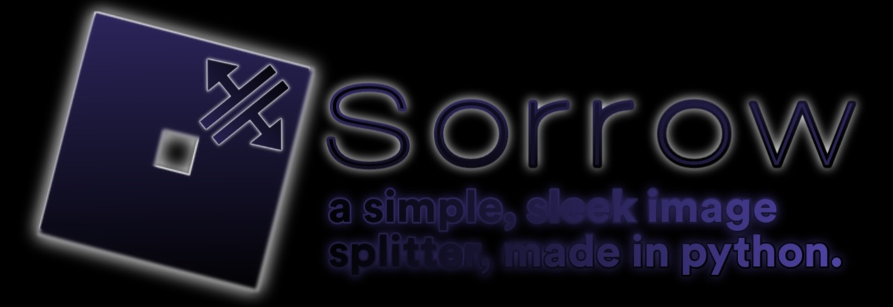

# sorrow — an image splitter (for Roblox)

A tiny, fast, and friendly desktop GUI that splits an image into two complementary PNGs using a variety of masks (noise, grids, stripes, rings, Voronoi, and more). Great for Roblox workflows where you want to layer/animate halves separately (e.g., UI reveals, wipe transitions, puzzle effects, “tear apart” visuals), but it’s also useful for general compositing anywhere.

> The app is a Tkinter + Pillow GUI—no command line required. Open an image, pick a split mode, tweak a couple sliders, and export the left/right parts (plus an optional composite preview PNG).

---

## Features

* **18 split modes**: Spots, Noise, SmoothNoise, Grid, Checkerboard, Stripes (V/H), Diagonal (two angles), Mosaic, Rings, RadialSlices, WaveX, WaveY, Vertical/Horizontal hard splits, and Voronoi.
* **Simple controls**:

  * **Mode**: choose the splitting pattern.
  * **Granularity**: coarser ↔ finer pattern density.
  * **Bias A**: balances which side gets more area.
  * **Fixed seed** (optional): get repeatable splits.
  * **Export name**: folder & file basename.
* **Instant previews** of both halves.
* **One-click export**: left/right PNGs (with alpha) and an optional side-by-side composite.
* **Smart output location**: writes to a sensible, user-writable folder automatically.
* **Packaged-app friendly**: resource loading supports PyInstaller style bundles.

---

## 📦 Installation

### 1) From source (Python 3.9+ recommended)

```bash
# (optional) create a virtual environment
python -m venv .venv
# Windows
.venv\Scripts\activate
# macOS/Linux
source .venv/bin/activate

# install dependencies
pip install pillow
# Tkinter:
# - Windows: included with python.org installer
# - macOS: included with python.org installer
# - Debian/Ubuntu: sudo apt-get install python3-tk
```

### 2) Run

```bash
python split.py
```

The app window should appear. Use **Open Image** to load a PNG/JPG/etc.

> If you plan to share a single-file EXE, see **Building a distributable** below.

---

## 🕹️ Usage

1. **Open Image**: load a PNG/JPG/WebP/BMP/TIFF (converted internally to RGBA).
2. **Pick a Mode** and tune **Granularity** + **Bias A**:

   * **Granularity** increases/decreases pattern density or block size (depends on mode).
   * **Bias A** shifts coverage toward the left (“A”) or right (“B”) result.
3. (Optional) **Fixed seed**:

   * Enable it to make results reproducible (enter your own seed text/number, or leave blank to lock to mode+granularity).
4. **Randomize**: generate a fresh mask (unless fixed seed is on).
5. **Export**:

   * **Export Parts** → `{name}_left.png` and `{name}_right.png` (both have transparent backgrounds outside their mask).
   * **Export Composite** → `{name}_composite.png` (side-by-side preview).
   * **Export All** → both of the above.

**Output folder**
By default, the app creates/uses a writable `output` folder next to the executable or script; if that fails, it falls back to one of the standard locations (e.g., `~/Pictures/sorrow_output` or `~/Documents/sorrow_output`). You can set the base name in the **Export name** field; files are placed in a subfolder of that name.&#x20;

---

## 🧊 Roblox workflow tips

You can use the exported halves in a few common ways:

### A) UI (ScreenGui) split reveal

* Import both PNGs into Roblox Studio (**View ▸ Asset Manager ▸ Bulk Import**).
* Add two **ImageLabel**s (or **ImageButtons**) to a **Frame**.
* Assign the left image to the bottom ImageLabel; assign the right image to a second ImageLabel above it.
* Animate `Position`, `Size`, or `ImageTransparency` to create wipes/reveals.
  Tip: Keep `ZIndex` consistent; anchor both to the same frame for aligned movement.

### B) 3D part overlays

* Insert two **Decal** or **Texture** objects on a Part/MeshPart (or two separate objects).
* Assign the left PNG to one side/object and the right PNG to the other.
  Tip: Use complementary **Transparency** values or tweens for interactive dissolve effects.

Because both images have alpha, you can stack them perfectly without visible seams.

---

## 🧠 Modes cheat-sheet

* **Spots** – random soft-ish dots with density affected by granularity & bias.
* **Noise** – blocky random cells (nearest-neighbor upscaling).
* **SmoothNoise** – blurred thresholded noise for organic regions.
* **Grid** – random filled rectangles on a uniform grid.
* **Checkerboard** – alternating cells with optional randomness.
* **StripesV / StripesH** – vertical or horizontal bands of varying widths/heights.
* **DiagonalSlash / DiagonalBackslash** – angled band stacks, cropped to image.
* **Mosaic** – variable-sized rectangles tiled across the image.
* **Rings** – concentric ring bands from the image center.
* **RadialSlices** – pie-slice wedges, alternating coverage.
* **WaveX / WaveY** – horizontal/vertical sine-wave bands.
* **Vertical / Horizontal** – single hard split at a random position.
* **Voronoi** – cell regions seeded randomly; each cell assigned to A or B.

All modes produce a binary mask that becomes the alpha for each half, so your left/right PNGs remain perfectly complementary.

---

## 🏗️ Building a distributable (optional)

This project is ready for PyInstaller style packaging (it uses a `resource_path` helper and checks `sys._MEIPASS`). Typical flow:

```bash
pip install pyinstaller
pyinstaller -F -w split.py \
  --name sorrow \
  --icon app_icon.ico
```

If you have `app_icon.png`/`app_icon.ico`, include them via `--add-data "app_icon.png;." --icon app_icon.ico`. The app writes to a user-writable “output” location at runtime (see **Output folder** above).&#x20;

---

## 🧩 Implementation highlights

* **GUI stack**: Tkinter (custom rounded button/slider/select widgets) + Pillow for image I/O and mask generation.
* **Two-pass export**: builds a single mask, then produces:

  * **Left**: original image with mask as alpha.
  * **Right**: original image with inverse mask as alpha.
* **Composite preview**: places halves side-by-side with a small gap.
* **Determinism**: optional fixed seed (string/number) so the same mode + granularity can reproduce a mask.
* **Extendability**: add new algorithms in `_generate_mask()` by returning an `"L"` (grayscale) image where white=left, black=right.&#x20;

---

## 🔧 Development

```bash
# lint/format (optional, if you use Ruff/Black)
pip install ruff black
ruff check .
black .
```

**Add a new mode**

1. Open `split.py`, find `_generate_mask(self, size)`.
2. Implement your pattern (return a Pillow `"L"` image sized `(w, h)` with values 0 or 255).
3. Append the mode name to the `XSelect` values list in `__init__` so it shows up in the UI.
4. Use **Fixed seed** while testing to keep results stable.&#x20;

---

## ❓ FAQ

**Why “Bias A”?**
It’s a probability threshold that nudges whether a given region is assigned to the **left (A)** half vs the **right (B)** half, depending on the mode. Turning it up usually grows the A coverage.

**Does it change image quality?**
No resampling is applied to the source except for preview scaling. Exports keep the original size and pixels—only alpha differs per half.

**Large images?**
It should handle large images; some modes create a downscaled “mini mask” for performance then upscale it for the final mask.

**CLI support?**
This build is GUI-only.

---

## 📝 License

Choose a license you’re comfortable with (MIT is a common default). Add a `LICENSE` file to the repo.

---

## 🙌 Acknowledgements

* [Pillow (PIL fork)](https://python-pillow.org/)
* Tk/Tkinter (bundled with CPython installers)

---

## 📷 Screenshots (optional)

Add a few before/after shots or short GIFs demonstrating a couple modes in action—especially useful for your GitHub README.

---

## Repository structure

```
.
├─ split.py          # the app (run this)
├─ app_icon.ico/png  # optional, if you want a custom window/exe icon
└─ output/           # created on first export (or user Pictures/Documents fallback)
```

Happy splitting!

